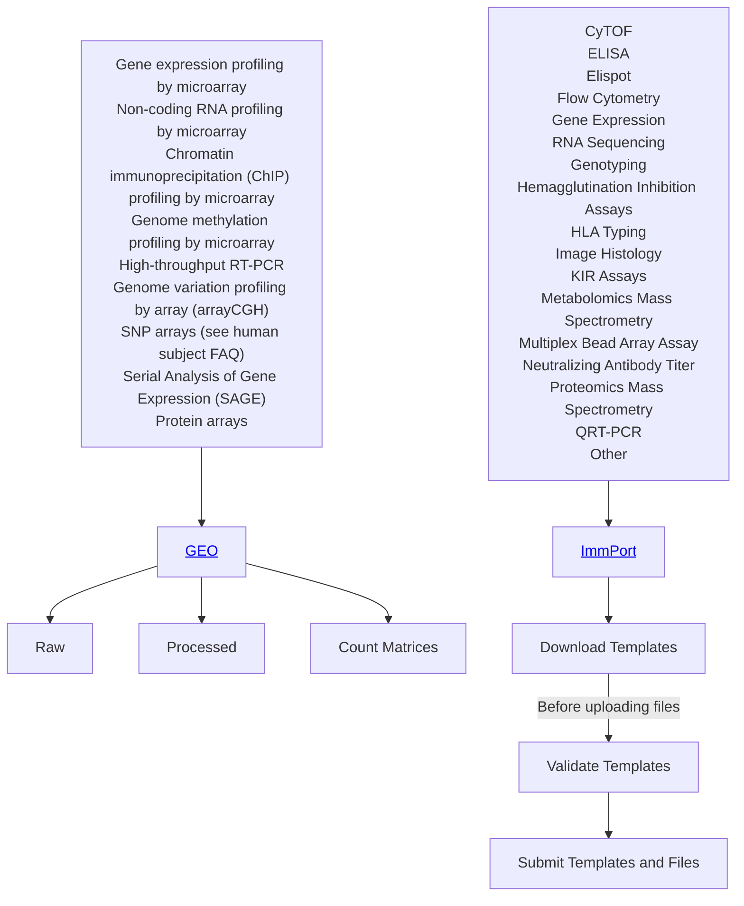

## Data Types

```mermaid
flowchart TD
    %% repositories
    %% R[Repositories]
    G[<a href="https://www.ncbi.nlm.nih.gov/geo/info/submission.html"><u>GEO</u></a>]
    I[<a href="https://docs.immport.org/datasubmission/general/"><u>ImmPort</u></a>]
    S[SRA]
    %% R --> G & I & S

    %% assay types
    %% A[Assays]
    %% MiArr[MicroArray]
    %% HTseq[High-throughput sequencing]
    %% Other[Nanostring, RT-PCR, Traditional Sage]
    

    %% A --> MiArr & HTseq & Other

    %% where does the data go? 
    %% geo
    geoAssays["`
    Gene expression profiling by microarray
    Non-coding RNA profiling by microarray
    Chromatin immunoprecipitation (ChIP) profiling by microarray
    Genome methylation profiling by microarray
    High-throughput RT-PCR
    Genome variation profiling by array (arrayCGH)
    SNP arrays (see human subject FAQ)
    Serial Analysis of Gene Expression (SAGE)
    Protein arrays
    `"] --> G
    %% MiArr --> G
    %% HTSeq --> G
    %% Other --> G

    %% import
    %% D1{Immunology?} --> I
    %% ELISA --> I
    %% ELISPOT --> I
    %% HAI --> I
    %% N[Neutralizing Antibody Titer] --> I
    %% RT-PCR --> I
    %% F[Flow cytometry] --> I
    %% HLA --> I
    %% KIR --> I
    %% GE[Gene expression] --> I
    %% RNAseq[RNA sequencing] --> I
    %% Geno[Genotyping] --> I
    %% MBAA --> I
    %% Non[Non-sample based assessments] --> I

    newLines["`
CyTOF
ELISA
Elispot
Flow Cytometry
Gene Expression
RNA Sequencing
Genotyping
Hemagglutination Inhibition Assays
HLA Typing
Image Histology
KIR Assays
Metabolomics Mass Spectrometry
Multiplex Bead Array Assay
Neutralizing Antibody Titer
Proteomics Mass Spectrometry
QRT-PCR
Other
    `"] --> I

    %% required data types
    G --> Raw
    G --> Processed
    G --> C[Count Matrices]

    %% I --> 

    %% process
    I --> D[Download Templates]
    D --> |Before uploading files|V[Validate Templates]
    V --> S[Submit Templates and Files]

```