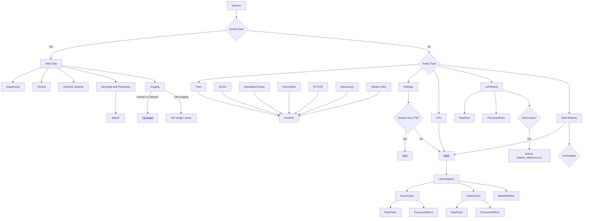

# Where to upload your data

```mermaid
flowchart TD

S[Species]
%% H[Human]
%% NH[Non-Human]

bulkRNAseq[Bulk RNAseq]
Hd{Human Data}

S --> Hd
Hd --> |Yes|DT[Data Type]
DT --> Seq[Sequencing]
DT --> Clin[Clinical]
DT --> GTR[Genomic Variants]
DT --> Phen[Genotype and Phenotype]
Phen --> dbgap[dbGaP]
DT --> Imaging
Imaging --> |Human or Clinical?|TBPortal[<a href="https://tbportals.niaid.nih.gov/">TB Portal</a>]
Imaging --> |Cell Imaging|cell[Cell Image Library]

%% non human data

Hd --> |No|A{Assay Type}
A --> Flow --> I[ImmPort]
ELISA --> I
HA[Histological Assay] --> I
IB[Immunoblot] --> I
rtpcr[RT-PCR] --> I
Mi[Microscopy] --> I
WB[Western Blot] --> I
A --> RNAseq --> Size{Greater than 2TB?} --> |Yes|SRA[<a href="">SRA</a>]
A --> CFU
CFU --> GEO
A --> scRNAseq --> RawFiles
scRNAseq --> ProcessedFiles
scRNAseq --> MO{Multi-omics?} --> |Yes|F[Submit feature_reference.csv]
Size --> |No|GEO[<a href="https://www.ncbi.nlm.nih.gov/geo/info/seq.html">GEO</a>]
A --> bulkRNAseq
bulkRNAseq --> GEO
bulkRNAseq --> D{Demultiplex}

GEO --> UploadSpace
UploadSpace --> AssayType1 --> RawFiles1
AssayType1 --> ProcessedFiles1
UploadSpace --> AssayType2 --> RawFiles2
AssayType2 --> ProcessedFiles2
UploadSpace --> MetadataFiles
```