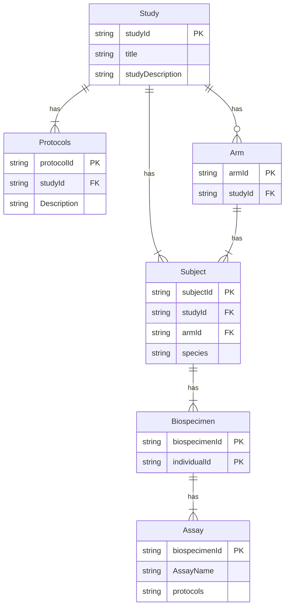
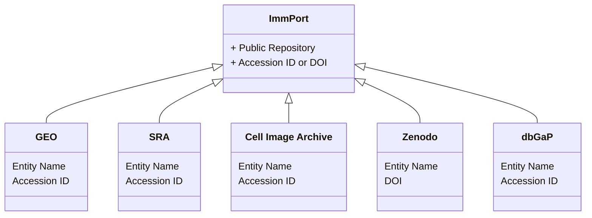
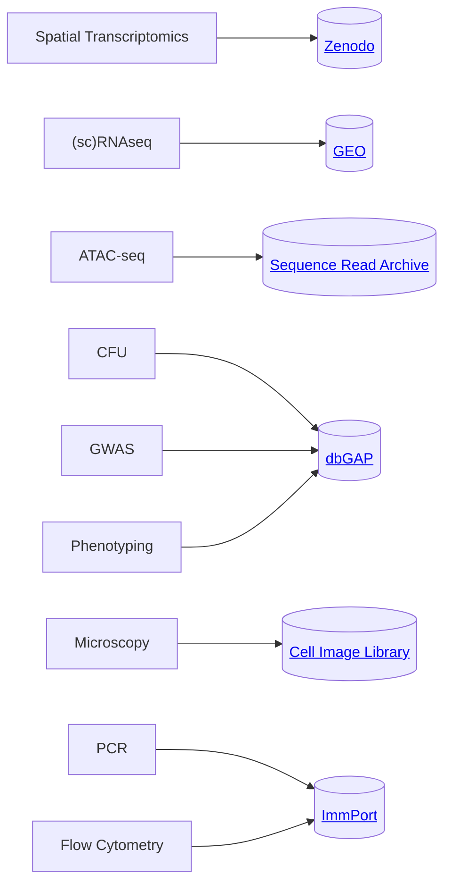
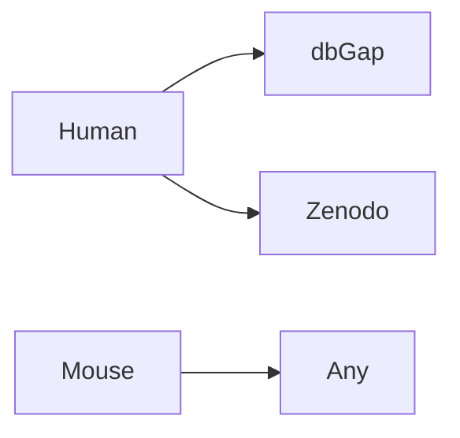

# {{ page.title }}

Documentation, templates, and tools for Cascade IMPAc-TB

- [{{ page.title }}](#-pagetitle-)
  - [About the Consortium and Studies](#about-the-consortium-and-studies)
  - [Templates](#templates)
  - [Metadata](#metadata)
    - [Connections](#connections)
    - [Legends](#legends)
      - [Cardinality](#cardinality)
      - [Aliases](#aliases)
  - [Repository Connections](#repository-connections)
  - [Assay Designations](#assay-designations)
  - [Data Designation by Species](#data-designation-by-species)
  - [Tools](#tools)

---  

## About the Consortium and Studies

- [NIH IMPAc-TB Site](https://www.niaid.nih.gov/research/immune-mechanisms-protection-mycobacterium-tuberculosis)
- [NIH Reporter Site](https://reporter.nih.gov/search/FfF_w27C_0GdNzBGP7gk1w/project-details/11179082)
- [Cascade Immune Mechanisms of Protection against Mycobacterium tuberculosis (IMPAc-TB): study protocol for the Household Contact Study in the Western Cape, South Africa](https://pmc.ncbi.nlm.nih.gov/articles/PMC9012070/#_ad93_)

## Templates

Can be found at [Github Repository](https://github.com/nlee-scri/Cascade-IMPAc-TB-Data-Submission-Tools/tree/main/templates) under templates. Contains information needed to upload to public repositories.

There are excel templates that are the most useful. Since the main repository is ImmPort, I recomend using [`templates/immport/study_composite_template.xlsx`](https://github.com/nlee-scri/Cascade-IMPAc-TB-Data-Submission-Tools/blob/main/templates/repositories/immport/study_composite_template.xlsx)

## Metadata

Main types of metadata needed

- Study
- Protocols
- Subjects
- Samples
- Experiments
- Results

### Connections

How the metadata is connected for people to find the information.
The main way is primary keys (PK) are used as foreign keys (FK) in the other tables.

When the data is collated it shoud look like this as a table:

| studyId  | protocol ID | Arm ID  | Subject ID | Biospecimen ID | Assay    | Results |
| -------- | ----------- | ------- | ---------- | -------------- | -------- | ------- |
| study_01 | RNAseq_01   | control | subject_01 | biospecimen_01 | assay_01 | ...     |
| study_01 | RNAseq_01   | control | subject_01 | biospecimen_01 | assay_01 | ...     |
| study_01 | RNAseq_01   | control | subject_01 | biospecimen_01 | assay_01 | ...     |

### Legends

| Abbreviation | Full        | Description                |
| ------------ | ----------- | -------------------------- |
| PK           | Primary Key | Unique values              |
| FK           | Foreign Key | Does not have to be unique |

#### Cardinality

| Value (left) | Value (right) | Meaning                       |
| ------------ | ------------- | ----------------------------- |
| \|o          | o\|           | Zero or one                   |
| \|\|         | \|\|          | Exactly one                   |
| \}o          | o\{           | Zero or more (no upper limit) |
| \}\|         | \|\{          | One or more (no upper limit)  |

#### Aliases

| Value (left) | Value (right) | Alias for    |
| ------------ | ------------- | ------------ |
| one or zero  | one or zero   | Zero or one  |
| zero or one  | zero or one   | Zero or one  |
| one or more  | one or more   | One or more  |
| one or many  | one or many   | One or more  |
| many(1)      | many(1)       | One or more  |
| 1+           | 1+            | One or more  |
| zero or more | zero or more  | Zero or more |
| zero or many | zero or many  | Zero or more |
| many(0)      | many(0)       | Zero or more |
| 0+           | 0+            | Zero or more |
| only one     | only one      | Exactly one  |
| 1            | 1             | Exactly one  |

 ---  

## Repository Connections

  ---  

## Assay Designations

Where assays go by type

  ---  

## Data Designation by Species

Due to human data needing to be under controled access if personal information can not be removed from the files, the data must be placed in *controled access* data repositories.

Model organism data can be placed in public repositories freely.

## [Tools](tools/README.md)

Python package to:

- Scraping metadata from files such as `.fcs`, `.ims`
- Validating and uploading data to public repositories
